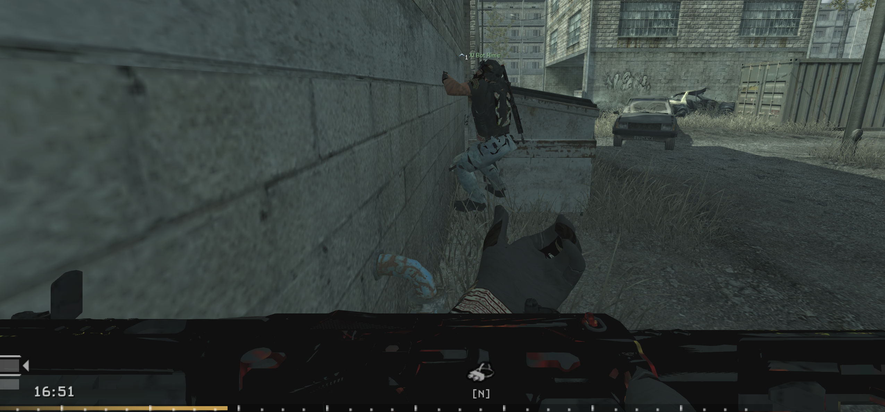

# ICR Engine-Axis Repair Round 1

## Runtime Finding

The user's 4 September proving session showed the ICR lying sideways across the lower half of the first-person view. The same session showed that the revised Ghost hand silhouette was substantially better, while its texture mapping and the Ghost third-person material conversion still failed visually.

## Root Cause

The attachment-composition round trip preserved the weapon's visible Blender-space bounds but rewrote the IW3 skeleton contract:

- Expected template `j_gun` quaternion: `[-0.7071068, 0, 0, 0.7071068]`
- Rejected runtime asset `j_gun` quaternion: `[-0.7071068, -0.7071068, 0, 0]`
- The rejected asset also omitted the explicit `skin.skeleton` root.

That explains why static renders looked centered while CoD4 drove the assembled weapon on the wrong axis.

## Repair

The candidate keeps the approved weapon and source-optic geometry, then restores every template joint transform, the explicit skeleton root, and inverse-bind matrices after the final Blender export.

- Promoted model SHA-256: `A2135296B0088ABFE7B959E9FE78334447E403D6A6633076452637D3E37B237E`
- Geometry: `21,087` weapon triangles; attachment placement unchanged
- Structural orientation suite: `PASS`, all `16` custom viewmodels
- Focused OAT build: `PASS`, `0` errors and `2` pre-existing sound warnings
- Focused `mod.ff`: `D06A7455E45D12C51769091573C997D23B2C70CBBB1B34367E330ADFC9BE20F3`
- Focused `xi_ftag.iwd`: `484137252000638C002953EB46B620C6DEAD97BD96E00A43C4FB7F4F7BBEDC10`

## Verdict

**STRUCTURAL PASS / USER-LIVE HOLD.** The exact defect visible in the runtime screenshot is repaired and guarded against recurrence, but the corrected axis still requires a new in-engine user view. Ghost arm UV/material repair and Ghost third-person material repair remain separate active rounds.
